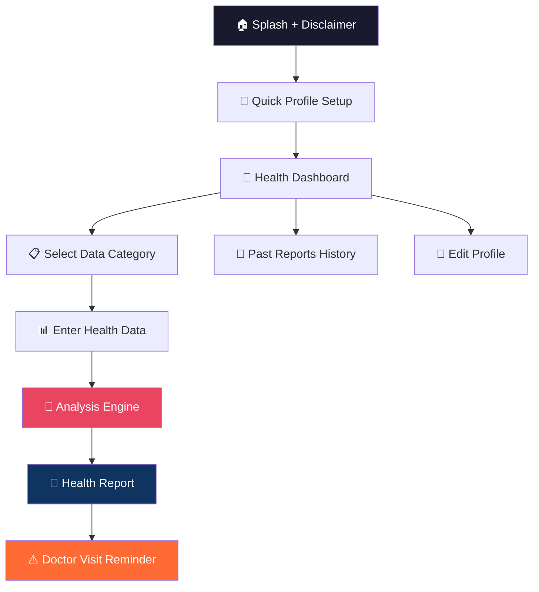
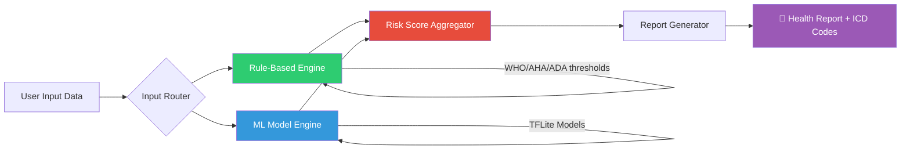

# Health Diagnosis App — Complete Plan

A mobile app (Android + iOS) where users input their medical data (blood reports, vitals, pregnancy data, etc.) and receive an AI-powered health risk assessment indicating which diseases they may have or be at risk for — using **only free, verified, and legally sourced data and models**.

> [!CAUTION]
> **Medical Disclaimer (Must be shown prominently in-app):**
> "This app provides health risk assessments for informational purposes only. It is NOT a substitute for professional medical advice, diagnosis, or treatment. Always consult a qualified healthcare provider. Results are based on statistical models and publicly available clinical guidelines — they may not apply to your specific situation."

---

## 1. App Flow — User Journey



### Step-by-Step Flow

| Step | Screen | What Happens |
|------|--------|--------------|
| 1 | **Splash Screen** | App logo + medical disclaimer popup (user must accept) |
| 2 | **Quick Profile** | Name, Age, Gender, Height, Weight, Blood Group (optional), Known conditions (optional) |
| 3 | **Dashboard** | Main hub: "Enter New Data", "View Past Reports", "My Profile" |
| 4 | **Data Entry** | Multi-select dropdown: user picks which data they have (e.g. "Blood Sugar", "Lipid Panel") |
| 5 | **Input Forms** | Dynamic forms appear for selected categories, with units and validation |
| 6 | **Processing** | Data sent to on-device ML models + rule-based engine |
| 7 | **Report** | Results screen showing risk levels per disease with color coding (Green/Yellow/Red) |
| 8 | **Disclaimer** | Every report ends with: "⚠️ This is an indicative report. Please visit a certified doctor for confirmation." |

---

## 2. Complete Health Data Inputs (What Users Can Enter)

### 2.1 Basic Profile
| Field | Type | Notes |
|-------|------|-------|
| Name | Text | Required |
| Age | Number | Required |
| Gender | Dropdown | Male / Female / Other |
| Height | Number | cm or ft/in |
| Weight | Number | kg or lbs |
| Blood Group | Dropdown | A+, A-, B+, B-, AB+, AB-, O+, O- |
| Known Medical Conditions | Multi-select | Diabetes, Hypertension, etc. |
| Family Medical History | Multi-select | Heart Disease, Cancer, Diabetes, etc. |
| Smoking Status | Dropdown | Never / Former / Current |
| Alcohol Consumption | Dropdown | None / Occasional / Regular / Heavy |

### 2.2 Vitals
| Parameter | Unit | Normal Range (Adult) |
|-----------|------|---------------------|
| Heart Rate (Resting) | bpm | 60–100 |
| Systolic BP | mmHg | < 120 |
| Diastolic BP | mmHg | < 80 |
| Body Temperature | °F / °C | 97.8–99.1°F |
| Respiratory Rate | breaths/min | 12–20 |
| SpO2 (Oxygen Saturation) | % | 95–100% |
| BMI | kg/m² | Auto-calculated |

### 2.3 Blood Sugar / Diabetes Panel
| Test | Unit | Normal | Pre-Diabetic | Diabetic |
|------|------|--------|-------------|----------|
| Fasting Blood Glucose | mg/dL | 70–99 | 100–125 | ≥126 |
| Post-Prandial (2hr) | mg/dL | < 140 | 140–199 | ≥200 |
| HbA1c | % | < 5.7 | 5.7–6.4 | ≥6.5 |
| Random Blood Sugar | mg/dL | < 140 | — | ≥200 |
| Fasting Insulin | µIU/mL | 2–25 | — | — |

### 2.4 Lipid Panel (Cholesterol)
| Test | Unit | Desirable | Borderline | High Risk |
|------|------|-----------|------------|-----------|
| Total Cholesterol | mg/dL | < 200 | 200–239 | ≥240 |
| LDL Cholesterol | mg/dL | < 100 | 100–159 | ≥160 |
| HDL Cholesterol | mg/dL | ≥60 | 40–59 | < 40 |
| Triglycerides | mg/dL | < 150 | 150–199 | ≥200 |
| VLDL Cholesterol | mg/dL | 5–40 | — | > 40 |

### 2.5 Complete Blood Count (CBC)
| Test | Unit | Normal Range (Male) | Normal Range (Female) |
|------|------|--------------------|-----------------------|
| Hemoglobin | g/dL | 14–18 | 12–16 |
| Hematocrit (PCV) | % | 42–52 | 37–47 |
| RBC Count | million/µL | 4.5–5.5 | 4.0–5.0 |
| WBC Count | cells/µL | 4,000–10,000 | 4,000–10,000 |
| Platelet Count | /µL | 150,000–400,000 | 150,000–400,000 |
| MCV | fL | 80–100 | 80–100 |
| MCH | pg | 27–33 | 27–33 |
| MCHC | g/dL | 32–36 | 32–36 |
| RDW | % | 11.5–14.5 | 11.5–14.5 |
| ESR | mm/hr | 0–15 | 0–20 |
| Neutrophils | % | 40–70 | 40–70 |
| Lymphocytes | % | 20–40 | 20–40 |
| Monocytes | % | 2–8 | 2–8 |
| Eosinophils | % | 1–4 | 1–4 |
| Basophils | % | 0–1 | 0–1 |

### 2.6 Liver Function Tests (LFT)
| Test | Unit | Normal Range |
|------|------|-------------|
| ALT (SGPT) | U/L | 7–56 |
| AST (SGOT) | U/L | 10–40 |
| ALP (Alkaline Phosphatase) | U/L | 44–147 |
| Total Bilirubin | mg/dL | 0.1–1.2 |
| Direct Bilirubin | mg/dL | 0.0–0.3 |
| Indirect Bilirubin | mg/dL | 0.1–1.0 |
| Total Protein | g/dL | 6.0–8.3 |
| Albumin | g/dL | 3.5–5.0 |
| Globulin | g/dL | 2.0–3.5 |
| A/G Ratio | — | 1.0–2.5 |
| GGT (Gamma GT) | U/L | 9–48 |

### 2.7 Kidney Function Tests (KFT / RFT)
| Test | Unit | Normal Range |
|------|------|-------------|
| Blood Urea Nitrogen (BUN) | mg/dL | 7–20 |
| Serum Creatinine | mg/dL | 0.6–1.2 |
| eGFR | mL/min/1.73m² | > 90 |
| Uric Acid | mg/dL | 3.5–7.2 (M), 2.6–6.0 (F) |
| BUN/Creatinine Ratio | — | 10:1 to 20:1 |
| Sodium (Na) | mEq/L | 135–145 |
| Potassium (K) | mEq/L | 3.5–5.0 |
| Chloride (Cl) | mEq/L | 95–105 |
| Calcium | mg/dL | 8.5–10.5 |
| Phosphorus | mg/dL | 2.5–4.5 |

### 2.8 Thyroid Panel
| Test | Unit | Normal Range |
|------|------|-------------|
| TSH | mIU/L | 0.4–4.0 |
| T3 (Total) | ng/dL | 80–200 |
| T4 (Total) | µg/dL | 5.0–12.0 |
| Free T3 | pg/mL | 2.0–4.4 |
| Free T4 | ng/dL | 0.8–1.8 |

### 2.9 Urine Analysis (Urinalysis)
| Test | Normal |
|------|--------|
| Color | Pale to Dark Yellow |
| pH | 4.5–8.0 |
| Specific Gravity | 1.005–1.030 |
| Protein | Negative |
| Glucose | Negative |
| Ketones | Negative |
| Bilirubin | Negative |
| Blood (Occult) | Negative |
| WBC in Urine | 0–5 /HPF |
| RBC in Urine | 0–2 /HPF |
| Nitrites | Negative |
| Leukocyte Esterase | Negative |
| Urobilinogen | 0.2–1.0 mg/dL |
| Casts | None |
| Crystals | None |
| Bacteria | None |
| Microalbumin | < 30 mg/L |
| Albumin/Creatinine Ratio | < 30 mg/g |

### 2.10 Stool Analysis
| Test | Normal |
|------|--------|
| Color | Brown |
| Consistency | Formed |
| Occult Blood | Negative |
| Ova & Parasites | Not Detected |
| WBC in Stool | Absent |
| RBC in Stool | Absent |
| Fat (Sudan Stain) | Negative |
| Reducing Substances | Negative |
| pH | 7.0–7.5 |
| Pus Cells | Absent |

### 2.11 Pregnancy & Women's Health
| Test | Unit | Normal Range |
|------|------|-------------|
| Beta-hCG | mIU/mL | Varies by trimester |
| Pregnancy Period | Weeks | 1–42 |
| Gestational Diabetes Screen | mg/dL | < 140 (1hr GCT) |
| Hemoglobin (Prenatal) | g/dL | ≥ 11.0 |
| Blood Pressure (Prenatal) | mmHg | < 140/90 |
| Urine Protein (Prenatal) | — | Negative |
| Rubella IgG | — | Positive = immune |
| VDRL/RPR | — | Non-reactive |
| HIV Screening | — | Negative |
| Hepatitis B (HBsAg) | — | Negative |

### 2.12 Iron Panel
| Test | Unit | Normal Range |
|------|------|-------------|
| Serum Iron | µg/dL | 60–170 |
| TIBC | µg/dL | 250–370 |
| Ferritin | ng/mL | 12–300 (M), 12–150 (F) |
| Transferrin Saturation | % | 20–50 |

### 2.13 Cardiac Markers
| Test | Unit | Normal |
|------|------|--------|
| Troponin I | ng/mL | < 0.04 |
| Troponin T | ng/mL | < 0.01 |
| CK-MB | U/L | 5–25 |
| BNP | pg/mL | < 100 |
| NT-proBNP | pg/mL | < 300 |
| CRP (High Sensitivity) | mg/L | < 1.0 (low risk) |
| Homocysteine | µmol/L | 5–15 |

### 2.14 Vitamins & Minerals
| Test | Unit | Normal Range |
|------|------|-------------|
| Vitamin D (25-OH) | ng/mL | 30–100 |
| Vitamin B12 | pg/mL | 200–900 |
| Folate (B9) | ng/mL | 2.7–17.0 |
| Magnesium | mg/dL | 1.7–2.2 |
| Zinc | µg/dL | 66–110 |

### 2.15 Hormones Panel
| Test | Unit | Normal Range |
|------|------|-------------|
| Testosterone (Total) | ng/dL | 300–1000 (M), 15–70 (F) |
| Estradiol | pg/mL | Varies by cycle/gender |
| Progesterone | ng/mL | Varies by cycle |
| LH | mIU/mL | Varies |
| FSH | mIU/mL | Varies |
| Cortisol (Morning) | µg/dL | 6–23 |
| Prolactin | ng/mL | 2–29 (F), 2–18 (M) |
| DHEA-S | µg/dL | Varies by age/gender |
| Insulin | µIU/mL | 2–25 |

### 2.16 Inflammation & Autoimmune Markers
| Test | Unit | Normal |
|------|------|--------|
| CRP | mg/L | < 10 |
| ESR | mm/hr | 0–20 |
| ANA | — | Negative |
| Rheumatoid Factor (RF) | IU/mL | < 14 |
| Anti-CCP | U/mL | < 20 |

### 2.17 Infectious Disease Screening
| Test | Normal |
|------|--------|
| HIV (ELISA) | Negative |
| Hepatitis B (HBsAg) | Negative |
| Hepatitis C (Anti-HCV) | Negative |
| VDRL (Syphilis) | Non-reactive |
| Dengue NS1 Antigen | Negative |
| Malaria (Rapid Test) | Negative |
| Widal Test (Typhoid) | < 1:80 |
| TB (Mantoux/IGRA) | Negative |

---

## 3. Complete Disease Detection List

Below are all diseases the app can screen for, grouped by organ system. Each uses specific data inputs and a combination of **rule-based thresholds** (from clinical guidelines) and **ML model predictions**.

### 🫀 3.1 Cardiovascular Diseases
| # | Disease | Key Inputs Required | Detection Method |
|---|---------|--------------------|--------------------|
| 1 | Hypertension (High BP) | Systolic/Diastolic BP | Rule: AHA/WHO guidelines |
| 2 | Hypotension (Low BP) | Systolic/Diastolic BP | Rule: < 90/60 |
| 3 | Coronary Artery Disease | Age, BP, Cholesterol, Smoking, Diabetes, Gender | ML: Framingham Risk Score + UCI Heart Dataset model |
| 4 | Heart Attack Risk | Troponin, CK-MB, BNP, BP, Cholesterol | Rule + ML |
| 5 | Heart Failure Risk | BNP/NT-proBNP, BP, Age | Rule: BNP thresholds |
| 6 | Atrial Fibrillation Risk | Heart Rate, Age, BP | Rule: irregular/high HR |
| 7 | Peripheral Artery Disease | BP, Cholesterol, Smoking, Diabetes | ML: Risk scoring |
| 8 | Hypercholesterolemia | Total, LDL, HDL, Triglycerides | Rule: ATP III Guidelines |
| 9 | Atherosclerosis Risk | LDL, hsCRP, Homocysteine | Rule + ML |

### 🩸 3.2 Diabetes & Metabolic Disorders
| # | Disease | Key Inputs | Detection Method |
|---|---------|-----------|------------------|
| 10 | Type 2 Diabetes | FBS, HbA1c, PP, BMI, Age | Rule: ADA criteria + ML: Pima/Kaggle model |
| 11 | Pre-Diabetes | FBS, HbA1c | Rule: ADA criteria |
| 12 | Gestational Diabetes | GCT, FBS, Pregnancy Status | Rule: IADPSG criteria |
| 13 | Metabolic Syndrome | BP, FBS, Triglycerides, HDL, Waist/BMI | Rule: NCEP ATP III (≥3 of 5 criteria) |
| 14 | Insulin Resistance | Fasting Insulin, FBS, BMI | Rule: HOMA-IR calculation |
| 15 | Obesity/Overweight | BMI, Weight, Height | Rule: WHO BMI classification |

### 🫁 3.3 Kidney Diseases
| # | Disease | Key Inputs | Detection Method |
|---|---------|-----------|------------------|
| 16 | Chronic Kidney Disease (Stage 1–5) | eGFR, Creatinine, BUN, Albumin/Creatinine ratio | Rule: KDIGO staging + ML: UCI CKD model |
| 17 | Acute Kidney Injury Risk | Creatinine trend, BUN, eGFR | Rule: KDIGO AKI criteria |
| 18 | Kidney Stones Risk | Uric Acid, Calcium, Urine pH, Urine Crystals | Rule: risk factor scoring |
| 19 | Nephrotic Syndrome Risk | Urine Protein, Albumin, Cholesterol | Rule: heavy proteinuria |
| 20 | Urinary Tract Infection | Urine WBC, Nitrites, Leukocyte Esterase, Bacteria | Rule: urinalysis criteria |

### 🫘 3.4 Liver Diseases
| # | Disease | Key Inputs | Detection Method |
|---|---------|-----------|------------------|
| 21 | Fatty Liver Disease (NAFLD) | ALT, AST, GGT, BMI, Triglycerides | Rule: FLI score + ML: ILPD model |
| 22 | Hepatitis Risk | ALT, AST, Bilirubin, HBsAg, Anti-HCV | Rule + screening markers |
| 23 | Liver Cirrhosis Risk | AST/ALT ratio, Albumin, Bilirubin, Platelets | Rule: APRI/FIB-4 scores |
| 24 | Jaundice | Bilirubin (Total, Direct) | Rule: Bilirubin > 2.5 |
| 25 | Alcoholic Liver Disease | GGT, AST/ALT ratio, Alcohol history | Rule: GGT + AST/ALT > 2 |

### 🦋 3.5 Thyroid Disorders
| # | Disease | Key Inputs | Detection Method |
|---|---------|-----------|------------------|
| 26 | Hypothyroidism | TSH, Free T4 | Rule: High TSH, Low FT4 |
| 27 | Hyperthyroidism | TSH, Free T3, Free T4 | Rule: Low TSH, High FT3/FT4 |
| 28 | Subclinical Thyroid Disease | TSH, Free T4 | Rule: TSH abnormal, FT4 normal |

### 🩸 3.6 Blood Disorders
| # | Disease | Key Inputs | Detection Method |
|---|---------|-----------|------------------|
| 29 | Iron Deficiency Anemia | Hemoglobin, Ferritin, Iron, TIBC, MCV | Rule: WHO anemia criteria |
| 30 | Vitamin B12 Deficiency Anemia | Hemoglobin, B12, MCV (high) | Rule: Macrocytic anemia |
| 31 | Thalassemia Trait Screen | MCV, MCH, RBC count, HbA2 | Rule: Mentzer Index |
| 32 | Polycythemia Risk | Hemoglobin, Hematocrit, RBC | Rule: elevated counts |
| 33 | Thrombocytopenia | Platelet Count | Rule: < 150,000/µL |
| 34 | Thrombocytosis | Platelet Count | Rule: > 400,000/µL |
| 35 | Leukocytosis | WBC Count | Rule: > 11,000/µL |
| 36 | Leukopenia | WBC Count | Rule: < 4,000/µL |

### 🫄 3.7 Pregnancy Complications
| # | Disease | Key Inputs | Detection Method |
|---|---------|-----------|------------------|
| 37 | Pre-eclampsia Risk | BP, Urine Protein, Pregnancy Period | Rule: ACOG criteria |
| 38 | Gestational Diabetes | GCT, FBS | Rule: IADPSG/ADA |
| 39 | Pregnancy Anemia | Hemoglobin, Ferritin | Rule: Hb < 11 g/dL |
| 40 | HELLP Syndrome Risk | Platelets, AST, LDH, Bilirubin | Rule: lab criteria |
| 41 | Ectopic Pregnancy Risk | Beta-hCG trend | Rule: hCG doubling time |

### 🦴 3.8 Nutritional Deficiencies
| # | Disease | Key Inputs | Detection Method |
|---|---------|-----------|------------------|
| 42 | Vitamin D Deficiency | 25-OH Vitamin D | Rule: < 20 ng/mL deficient |
| 43 | Vitamin B12 Deficiency | Serum B12 | Rule: < 200 pg/mL |
| 44 | Folate Deficiency | Serum Folate | Rule: < 2.7 ng/mL |
| 45 | Iron Deficiency | Ferritin, Serum Iron, TIBC | Rule: Low ferritin |
| 46 | Calcium Deficiency | Serum Calcium | Rule: < 8.5 mg/dL |
| 47 | Magnesium Deficiency | Serum Magnesium | Rule: < 1.7 mg/dL |

### 🦠 3.9 Infectious Diseases
| # | Disease | Key Inputs | Detection Method |
|---|---------|-----------|------------------|
| 48 | Dengue (Screen) | Dengue NS1, Platelets, WBC | Rule: NS1 + low platelets |
| 49 | Malaria (Screen) | Malaria RDT, symptoms | Rule: positive RDT |
| 50 | Typhoid (Screen) | Widal Test | Rule: titer ≥ 1:160 |
| 51 | Tuberculosis Screen | Mantoux/IGRA | Rule: positive result |
| 52 | HIV Screening | HIV ELISA | Rule: reactive |
| 53 | Hepatitis B Screening | HBsAg | Rule: positive |
| 54 | Hepatitis C Screening | Anti-HCV | Rule: positive |
| 55 | Urinary Tract Infection | Urine analysis | Rule: WBC, nitrites, bacteria |

### 💪 3.10 Musculoskeletal / Autoimmune
| # | Disease | Key Inputs | Detection Method |
|---|---------|-----------|------------------|
| 56 | Rheumatoid Arthritis Risk | RF, Anti-CCP, ESR, CRP | Rule: ACR criteria |
| 57 | Gout Risk | Uric Acid | Rule: > 7.0 mg/dL (M), > 6.0 (F) |
| 58 | Osteoporosis Risk | Age, Gender, BMI, Calcium, Vit D | Rule: risk scoring (FRAX-like) |
| 59 | Lupus (SLE) Screen | ANA, ESR, CBC | Rule: positive ANA + criteria |

### 🧠 3.11 Other Important Conditions
| # | Disease | Key Inputs | Detection Method |
|---|---------|-----------|------------------|
| 60 | PCOS (Polycystic Ovary Syndrome) | LH/FSH ratio, Testosterone, DHEA-S, BMI, Insulin | Rule: Rotterdam criteria |
| 61 | Electrolyte Imbalance | Na, K, Cl, Ca, Mg | Rule: out of normal range |
| 62 | Dehydration Risk | Urine Specific Gravity, Na, BUN/Creatinine ratio | Rule: high SG + elevated BUN |
| 63 | Sepsis Risk Screen | WBC, CRP, Temperature, HR, RR | Rule: qSOFA + SIRS criteria |
| 64 | Prostate Issue Risk (PSA) | PSA level, Age | Rule: > 4.0 ng/mL |

### 🎗️ 3.12 Cancer Risk Screening
| # | Disease | Key Inputs | Detection Method |
|---|---------|-----------|------------------|
| 65 | Colorectal Cancer Screen | Stool Occult Blood, Age | Rule: positive FOBT |
| 66 | Prostate Cancer Screen | PSA, Age, Family History | Rule: elevated PSA |
| 67 | Breast Cancer Risk | Age, Family History, Gender, BMI | ML: risk scoring model |

> **Total: 67 diseases & conditions** screened across 12 medical categories.

---

## 4. Free, Verified Data Sources & APIs — All Links

### 4.1 Direct APIs (Free Tier Available)

#### 🔹 WHO ICD-11 API (Disease Classification)
- **Portal & Registration:** https://icd.who.int/icdapi
- **Base API URL:** `https://id.who.int/`
- **Token Endpoint:** `https://icdaccessmanagement.who.int/connect/token`
- **Swagger Docs:** https://id.who.int/swagger/icd/v2/swagger.json
- **Auth:** OAuth 2.0 — Register to get `CLIENT_ID` + `CLIENT_SECRET` (free)
- **Example:** `GET https://id.who.int/icd/entity/search?q=diabetes`

#### 🔹 NIH Clinical Table Search (ICD-10-CM Lookup)
- **API Endpoint:** `https://clinicaltables.nlm.nih.gov/api/icd10cm/v3/search`
- **Docs:** https://clinicaltables.nlm.nih.gov/apidoc/icd10cm/v3/doc.html
- **Auth:** None required (fully open)
- **Example:** `GET https://clinicaltables.nlm.nih.gov/api/icd10cm/v3/search?terms=diabetes&sf=code,name`

#### 🔹 openFDA (Drug Info & Adverse Events)
- **Base URL:** `https://api.fda.gov/`
- **Docs:** https://open.fda.gov/apis/
- **GitHub:** https://github.com/FDA/openfda
- **Auth:** Optional API key for higher rate limits (free registration)
- **Example:** `GET https://api.fda.gov/drug/label.json?search=metformin&limit=5`

#### 🔹 WHO GHO OData API (Global Health Statistics)
- **Base URL:** `https://ghoapi.azureedge.net/api/`
- **Docs:** https://www.who.int/data/gho/info/gho-odata-api
- **Auth:** None required
- **Example:** `GET https://ghoapi.azureedge.net/api/Indicator` (list all indicators)

#### 🔹 Open Disease API (Disease Statistics)
- **Base URL:** `https://disease.sh/v3/covid-19/` (also covers general disease data)
- **Docs:** https://disease.sh/docs/
- **GitHub:** https://github.com/disease-sh/API
- **Auth:** None required

#### 🔹 icd10api.com (ICD-10 Code Validation)
- **Base URL:** `https://icd10api.com/`
- **Docs:** https://icd10api.com/#icd10-json-api
- **Auth:** None required
- **Limit:** Free — 2,500 requests/day
- **Example:** `GET https://icd10api.com/?code=E11&desc=short&r=json`

#### 🔹 NIH Medical Conditions API
- **API Endpoint:** `https://clinicaltables.nlm.nih.gov/api/conditions/v3/search`
- **Auth:** None required
- **Provides:** 2,400+ medical conditions with ICD-10 codes

---

### 4.2 ML Datasets — Download Links

| # | Dataset | Download URL | Disease | Size |
|---|---------|-------------|---------|------|
| 1 | **Pima Indians Diabetes** | https://www.kaggle.com/datasets/uciml/pima-indians-diabetes-database | Diabetes | 768 records, 8 features |
| 2 | **Diabetes Prediction** | https://www.kaggle.com/datasets/iammustafatz/diabetes-prediction-dataset | Diabetes | 100K records, 9 features |
| 3 | **Heart Disease (Cleveland)** | https://doi.org/10.24432/C52P4X (UCI) | Heart Disease | 303 records, 14 features |
| 4 | **Heart Disease Merged** | https://www.kaggle.com/datasets/mexwell/heart-disease-dataset | Heart Disease | 1,888 records, 14 features |
| 5 | **Cardiovascular Disease** | https://www.kaggle.com/datasets/sulianova/cardiovascular-disease-dataset | CVD | 70,000 records, 12 features |
| 6 | **Chronic Kidney Disease** | https://doi.org/10.24432/C5G020 (UCI) | CKD | 400 records, 25 features |
| 7 | **Indian Liver Patient (ILPD)** | https://doi.org/10.24432/C5D02C (UCI) | Liver Disease | 584 records, 11 features |
| 8 | **Breast Cancer Wisconsin** | https://www.kaggle.com/datasets/uciml/breast-cancer-wisconsin-data | Breast Cancer | 569 records, 32 features |
| 9 | **Framingham Heart Study** | https://www.kaggle.com/datasets/aasheesh200/framingham-heart-study-dataset | 10-yr CHD Risk | 4,240 records |

---

### 4.3 Clinical Guidelines — Reference URLs

| Guideline | Organization | Reference URL |
|-----------|-------------|---------------|
| **BP Classification** | AHA/ACC | https://www.heart.org/en/health-topics/high-blood-pressure |
| **Diabetes Criteria** | ADA | https://diabetesjournals.org/care/issue/47/Supplement_1 |
| **Cholesterol / MetS** | NCEP ATP III (NIH) | https://www.nhlbi.nih.gov/health-topics/metabolic-syndrome |
| **CKD Staging** | KDIGO | https://kdigo.org/guidelines/ckd-evaluation-and-management/ |
| **Anemia Grading** | WHO | https://www.who.int/publications/i/item/9789240078642 |
| **Pregnancy** | ACOG | https://www.acog.org/clinical |
| **PCOS** | Rotterdam (ESHRE) | https://www.eshre.eu/Guidelines-and-Legal/Guidelines |
| **Rheumatoid Arthritis** | ACR/EULAR | https://www.rheumatology.org/Practice-Quality/Clinical-Support |
| **Gestational Diabetes** | IADPSG | https://www.iadpsg.org/ |
| **CVD Risk** | Framingham | https://www.framinghamheartstudy.org/ |

---

## 5. Technical Architecture

### 5.1 Tech Stack — Flutter + All Packages

| Layer | Package / Technology | pub.dev / URL | Purpose |
|-------|---------------------|---------------|----------|
| **Framework** | Flutter 3.x + Dart | https://flutter.dev | Cross-platform: Android → Web → iOS |
| **ML On-Device** | `tflite_flutter` v0.12.1 | https://pub.dev/packages/tflite_flutter | Run TFLite models on-device |
| **ML Helper** | `tflite_flutter_helper` | https://pub.dev/packages/tflite_flutter_helper | Input/output processing for models |
| **Local DB** | `hive` + `hive_flutter` | https://pub.dev/packages/hive | Fast NoSQL local storage |
| **Local DB alt** | `sqflite` | https://pub.dev/packages/sqflite | SQLite for structured queries |
| **State Mgmt** | `flutter_riverpod` | https://pub.dev/packages/flutter_riverpod | Clean app architecture |
| **HTTP Client** | `dio` | https://pub.dev/packages/dio | Call WHO/NIH/openFDA APIs |
| **Charts** | `fl_chart` | https://pub.dev/packages/fl_chart | Visualize health data in reports |
| **PDF Reports** | `pdf` + `printing` | https://pub.dev/packages/pdf | Generate downloadable reports |
| **Navigation** | `go_router` | https://pub.dev/packages/go_router | Declarative routing |
| **Forms** | `flutter_form_builder` | https://pub.dev/packages/flutter_form_builder | Dynamic health input forms |
| **Dropdowns** | `multi_select_flutter` | https://pub.dev/packages/multi_select_flutter | Multi-select data categories |
| **Icons** | `flutter_svg` + `lucide_icons` | https://pub.dev/packages/flutter_svg | Medical and UI icons |
| **Theming** | `google_fonts` | https://pub.dev/packages/google_fonts | Typography (Inter, Outfit) |
| **JSON** | `json_annotation` + `json_serializable` | https://pub.dev/packages/json_annotation | Serialize diseases/ranges data |
| **Firebase (opt)** | `firebase_core` + `firebase_analytics` | https://pub.dev/packages/firebase_core | Analytics & crash reporting |
| **Model Training** | Python + scikit-learn + TensorFlow | https://www.tensorflow.org/lite/guide | Train on PC → export `.tflite` |
| **TFLite Converter** | `tensorflow` Python package | https://www.tensorflow.org/lite/models/convert | Convert trained models to `.tflite` |

### 5.2 Hybrid Detection Architecture



**How it works:**

1. **Rule-Based Engine** — For conditions with clear clinical cutoffs (e.g., "FBS ≥ 126 = Diabetes"), use direct threshold comparisons from WHO/AHA/ADA/KDIGO guidelines. This covers ~40 of the 67 conditions.

2. **ML Model Engine** — For complex multi-factor diseases (heart disease, diabetes risk, liver disease, kidney disease, cancer risk), use pre-trained TensorFlow Lite models running entirely on-device. These models are trained on the free UCI/Kaggle datasets listed above.

3. **Risk Score Aggregator** — Combines both engines' outputs into a unified risk score per disease:
   - 🟢 **Low Risk** (0–30%) — "Your values are within normal range"
   - 🟡 **Moderate Risk** (30–70%) — "Some values are concerning, monitor closely"
   - 🔴 **High Risk** (70–100%) — "Your values indicate possible [condition], visit a doctor immediately"

---

## 6. ML Models — Training Plan (With All Links)

Pre-train these models on your development machine, then convert to TFLite for mobile.

### 6.1 Python Libraries Required

| Library | Install Command | URL | Purpose |
|---------|----------------|-----|---------|
| **scikit-learn** | `pip install scikit-learn` | https://scikit-learn.org/ | Random Forest, Logistic Regression, SVM |
| **XGBoost** | `pip install xgboost` | https://xgboost.readthedocs.io/ | Gradient boosted trees (best accuracy) |
| **TensorFlow** | `pip install tensorflow` | https://www.tensorflow.org/ | Neural networks + TFLite converter |
| **pandas** | `pip install pandas` | https://pandas.pydata.org/ | Dataset loading & preprocessing |
| **numpy** | `pip install numpy` | https://numpy.org/ | Numerical operations |
| **joblib** | (included with scikit-learn) | — | Model serialization |

### 6.2 Models — With Dataset Links & Reference Repos

#### 🔹 Model 1: Diabetes Predictor
- **Algorithm:** Random Forest / XGBoost
- **Datasets:**
  - Pima Indians Diabetes: https://www.kaggle.com/datasets/uciml/pima-indians-diabetes-database
  - Diabetes Prediction (100K): https://www.kaggle.com/datasets/iammustafatz/diabetes-prediction-dataset
- **Input Features:** BMI, Age, Glucose, HbA1c, BP, Insulin
- **Output:** Probability (0–1)
- **Reference Repo:** https://github.com/siddhardhan23/multiple-disease-prediction-streamlit-app

#### 🔹 Model 2: Heart Disease Predictor
- **Algorithm:** Logistic Regression / XGBoost
- **Datasets:**
  - UCI Cleveland: https://doi.org/10.24432/C52P4X
  - Kaggle Merged (1,888 records): https://www.kaggle.com/datasets/mexwell/heart-disease-dataset
  - Kaggle CVD (70K records): https://www.kaggle.com/datasets/sulianova/cardiovascular-disease-dataset
- **Input Features:** Age, Sex, BP, Cholesterol, Heart Rate, FBS, Chest Pain Type
- **Output:** Probability (0–1)
- **Reference Repo:** https://github.com/kb22/Heart-Disease-Prediction

#### 🔹 Model 3: Chronic Kidney Disease (CKD) Predictor
- **Algorithm:** Random Forest
- **Dataset:** UCI CKD: https://doi.org/10.24432/C5G020
- **Input Features:** Creatinine, BUN, eGFR, Albumin, BP, Age, Hemoglobin, WBC
- **Output:** Probability (0–1)
- **Reference Repo:** https://github.com/ChiragSaini/Chronic-Kidney-Disease-Prediction

#### 🔹 Model 4: Liver Disease Predictor
- **Algorithm:** Random Forest
- **Dataset:** ILPD (Indian Liver Patient): https://doi.org/10.24432/C5D02C
- **Input Features:** ALT, AST, ALP, Total Bilirubin, Albumin, A/G Ratio, Age, Gender
- **Output:** Probability (0–1)
- **Reference Repo:** https://github.com/PavanMudigonda/LiverDiseasePrediction

#### 🔹 Model 5: CVD 10-Year Risk Score
- **Algorithm:** Logistic Regression
- **Dataset:** Framingham: https://www.kaggle.com/datasets/aasheesh200/framingham-heart-study-dataset
- **Input Features:** Age, Gender, Systolic BP, Total Cholesterol, HDL, Smoking, Diabetes
- **Output:** 10-year CVD risk percentage
- **Guideline Reference:** https://www.framinghamheartstudy.org/

#### 🔹 Model 6: Breast Cancer Risk Classifier
- **Algorithm:** SVM / Random Forest
- **Dataset:** UCI Wisconsin: https://www.kaggle.com/datasets/uciml/breast-cancer-wisconsin-data
- **Input Features:** Age, Family History, BMI, hormonal factors, cell features
- **Output:** Risk level (Low / Medium / High)

### 6.3 Training → TFLite Conversion Workflow

```bash
# Step 1: Install dependencies
pip install scikit-learn xgboost tensorflow pandas numpy

# Step 2: Train model (example: diabetes)
python ml_training/train_diabetes.py
# → Saves trained model as trained_model.pkl

# Step 3: Convert to TensorFlow SavedModel
python ml_training/convert_to_tflite.py --model diabetes
# Uses tf.lite.TFLiteConverter internally

# Step 4: Output .tflite file
# → assets/ml_models/diabetes_predictor.tflite (~50KB–200KB per model)

# Step 5: Bundle in Flutter app via pubspec.yaml:
#   flutter:
#     assets:
#       - assets/ml_models/
```

**TFLite Converter Docs:** https://www.tensorflow.org/lite/models/convert
**Flutter TFLite Integration Guide:** https://pub.dev/packages/tflite_flutter#usage

---

## 7. Health Report Output Format

Each generated report will contain:

```
╔══════════════════════════════════════════════╗
║         🏥 HEALTH RISK ASSESSMENT REPORT     ║
║         Generated: Feb 22, 2026              ║
║         Patient: [Name], Age: [X], [Gender]  ║
╠══════════════════════════════════════════════╣
║                                              ║
║  DATA ANALYZED: Blood Sugar, Lipid Panel,    ║
║  CBC, Liver Function, Kidney Function        ║
║                                              ║
║  ═══ FINDINGS ═══                            ║
║                                              ║
║  🔴 HIGH RISK                                ║
║  ┌─────────────────────────────────────────┐ ║
║  │ Type 2 Diabetes — Risk: 87%             │ ║
║  │ Based on: FBS 142, HbA1c 7.1, BMI 31   │ ║
║  │ Guideline: ADA Standards of Care        │ ║
║  └─────────────────────────────────────────┘ ║
║                                              ║
║  🟡 MODERATE RISK                            ║
║  ┌─────────────────────────────────────────┐ ║
║  │ Fatty Liver Disease (NAFLD) — Risk: 55% │ ║
║  │ Based on: ALT 62, BMI 31, TG 180       │ ║
║  │ Guideline: FLI Score                    │ ║
║  └─────────────────────────────────────────┘ ║
║                                              ║
║  🟢 LOW RISK                                 ║
║  ┌─────────────────────────────────────────┐ ║
║  │ Heart Disease — Risk: 12%               │ ║
║  │ Kidney Disease — Risk: 8%               │ ║
║  │ Anemia — Risk: 5%                       │ ║
║  └─────────────────────────────────────────┘ ║
║                                              ║
║  ═══ ABNORMAL VALUES DETECTED ═══            ║
║  • FBS: 142 mg/dL (Normal: 70–99)           ║
║  • HbA1c: 7.1% (Normal: <5.7%)             ║
║  • ALT: 62 U/L (Normal: 7–56)              ║
║  • Triglycerides: 180 (Normal: <150)        ║
║                                              ║
║  ⚠️ IMPORTANT DISCLAIMER                    ║
║  This is an AI-generated indicative report.  ║
║  It is NOT a medical diagnosis. Please       ║
║  consult a certified doctor for proper       ║
║  evaluation and treatment.                   ║
╚══════════════════════════════════════════════╝
```

---

## 8. Project File Structure (Flutter / Dart)

```
disease_check_app/
├── lib/                              # Main Flutter source code
│   ├── main.dart                     # App entry point
│   ├── app.dart                      # MaterialApp + GoRouter setup
│   ├── screens/
│   │   ├── splash_screen.dart
│   │   ├── disclaimer_screen.dart
│   │   ├── profile_setup_screen.dart
│   │   ├── dashboard_screen.dart
│   │   ├── data_category_screen.dart  # Multi-select data types
│   │   ├── data_entry_screen.dart     # Dynamic forms per category
│   │   ├── processing_screen.dart     # Loading + analysis animation
│   │   ├── report_screen.dart         # Color-coded risk results
│   │   └── report_history_screen.dart
│   ├── widgets/
│   │   ├── health_input_form.dart
│   │   ├── risk_card.dart
│   │   ├── abnormal_value_badge.dart
│   │   └── disclaimer_banner.dart
│   ├── engine/
│   │   ├── rule_engine.dart           # WHO/AHA/ADA threshold checks
│   │   ├── ml_engine.dart             # TFLite model inference
│   │   ├── risk_aggregator.dart       # Combines rule + ML outputs
│   │   ├── report_generator.dart      # Generates final report
│   │   └── reference_ranges.dart      # All normal values database
│   ├── models/                        # Dart data models
│   │   ├── user_profile.dart
│   │   ├── health_data.dart
│   │   ├── disease.dart
│   │   └── report.dart
│   ├── providers/                     # Riverpod state management
│   │   ├── profile_provider.dart
│   │   ├── health_data_provider.dart
│   │   └── report_provider.dart
│   ├── services/
│   │   ├── icd_api_service.dart       # WHO ICD-11 API calls
│   │   ├── openfda_service.dart       # openFDA drug lookup
│   │   └── storage_service.dart       # Hive local persistence
│   ├── data/
│   │   ├── diseases.json              # All 67 diseases + ICD codes
│   │   ├── reference_ranges.json      # All lab test normal ranges
│   │   └── guidelines.json            # Clinical guideline rules
│   └── utils/
│       ├── bmi_calculator.dart
│       ├── unit_converter.dart        # mg/dL ↔ mmol/L etc.
│       ├── egfr_calculator.dart       # CKD-EPI equation
│       └── risk_scoring.dart          # Framingham, FLI, APRI etc.
├── assets/
│   ├── ml_models/                     # Pre-trained .tflite files
│   │   ├── diabetes_predictor.tflite
│   │   ├── heart_disease_predictor.tflite
│   │   ├── ckd_predictor.tflite
│   │   ├── liver_disease_predictor.tflite
│   │   └── cvd_risk_predictor.tflite
│   ├── icons/
│   └── images/
├── ml_training/                       # Python scripts (run on PC)
│   ├── train_diabetes.py
│   ├── train_heart.py
│   ├── train_ckd.py
│   ├── train_liver.py
│   ├── convert_to_tflite.py
│   └── datasets/                      # Downloaded UCI/Kaggle CSVs
├── pubspec.yaml                       # Flutter dependencies
├── android/                           # Android-specific config
├── ios/                               # iOS-specific config (future)
└── web/                               # Web config (future)
```

---

## 9. Verification Plan

### Automated Tests
- **Unit tests** for the rule engine: verify that threshold checks correctly classify known test values into correct disease categories (e.g., FBS = 130 → "Pre-Diabetes")
- **Unit tests** for ML inference: verify TFLite models load and produce valid probability outputs for test inputs
- **Integration tests**: feed sample patient profiles through full pipeline (input → rule engine + ML → report) and verify output matches expected diagnoses

### Manual Verification
1. **Test with known medical case studies** — Input known patient data from published case studies and verify the app's output matches the expected disease diagnoses
2. **Cross-validate with reference ranges** — Enter boundary values (e.g., FBS = 99 vs 100 vs 126) and verify correct classification at every threshold
3. **Test on physical devices** — Run on Android and iOS devices to verify TFLite model performance and UI responsiveness
4. **User acceptance testing** — Have the user review the report output format and verify disclaimers are prominently displayed

---

## 10. Legal & Compliance Notes

> [!IMPORTANT]
> - App must clearly state it is **not a medical device** and does not provide medical diagnoses
> - All data processing happens **on-device** — no user health data is sent to external servers
> - Must comply with local health app regulations (India: Digital Health Guidelines, US: FDA guidance on health apps)
> - Every prediction must be preceded by the source guideline (WHO, AHA, ADA, etc.)
> - No prescriptions, treatment recommendations, or drug advice — only risk assessment
> - Must display **"Consult a Doctor"** prominently on every report

---

## 11. Environment Setup — Install Everything

### 11.1 Required Software (Download & Install)

| # | Software | Download URL | Version | Purpose |
|---|----------|-------------|---------|---------|
| 1 | **Flutter SDK** | https://docs.flutter.dev/get-started/install/windows/mobile | Latest stable (3.x) | App framework |
| 2 | **Android Studio** | https://developer.android.com/studio | Latest | Android SDK + Emulator |
| 3 | **Java JDK** | https://adoptium.net/ (Temurin) | JDK 17 | Required by Android build |
| 4 | **Git** | https://git-scm.com/download/win | Latest | Version control |
| 5 | **VS Code** | https://code.visualstudio.com/ | Latest | Code editor (optional) |
| 6 | **Python** | https://www.python.org/downloads/ | 3.10+ | ML model training |
| 7 | **Kaggle Account** | https://www.kaggle.com/account/login | Free | Download datasets |

### 11.2 Flutter Setup (Windows Step-by-Step)

```powershell
# Step 1: Download Flutter SDK from URL above, extract to C:\flutter

# Step 2: Add to PATH (System Environment Variables)
# Add: C:\flutter\bin

# Step 3: Verify installation
flutter doctor

# Step 4: Install Android Studio, then in Android Studio:
# → SDK Manager → Install Android SDK 34+
# → SDK Manager → SDK Tools → Install:
#   - Android SDK Build-Tools
#   - Android SDK Command-line Tools
#   - Android Emulator
#   - Android SDK Platform-Tools

# Step 5: Accept Android licenses
flutter doctor --android-licenses

# Step 6: Install VS Code extensions (if using VS Code)
# → Flutter extension
# → Dart extension

# Step 7: Verify everything is green
flutter doctor -v
# All items should show [✓]
```

### 11.3 Python Setup (for ML Training)

```powershell
# Install Python from URL above, check "Add to PATH" during install

# Verify
python --version

# Install all ML libraries in one command
pip install scikit-learn xgboost tensorflow pandas numpy matplotlib seaborn joblib
```

---

## 12. Project Creation — Exact Commands

```powershell
# Step 1: Navigate to your projects folder
# (Do NOT cd, just use full path in commands)

# Step 2: Create Flutter project
flutter create --org com.healthcheck --project-name disease_check_app d:\Software\Projects\DiseaseCheckApp

# Step 3: Open in VS Code
code d:\Software\Projects\DiseaseCheckApp

# Step 4: Create folder structure
mkdir d:\Software\Projects\DiseaseCheckApp\lib\screens
mkdir d:\Software\Projects\DiseaseCheckApp\lib\widgets
mkdir d:\Software\Projects\DiseaseCheckApp\lib\engine
mkdir d:\Software\Projects\DiseaseCheckApp\lib\models
mkdir d:\Software\Projects\DiseaseCheckApp\lib\providers
mkdir d:\Software\Projects\DiseaseCheckApp\lib\services
mkdir d:\Software\Projects\DiseaseCheckApp\lib\data
mkdir d:\Software\Projects\DiseaseCheckApp\lib\utils
mkdir d:\Software\Projects\DiseaseCheckApp\assets\ml_models
mkdir d:\Software\Projects\DiseaseCheckApp\assets\icons
mkdir d:\Software\Projects\DiseaseCheckApp\assets\images
mkdir d:\Software\Projects\DiseaseCheckApp\ml_training\datasets
```

---

## 13. pubspec.yaml — Exact Copy-Paste

```yaml
name: disease_check_app
description: AI-powered health diagnosis app using verified medical data
publish_to: 'none'
version: 1.0.0+1

environment:
  sdk: '>=3.2.0 <4.0.0'

dependencies:
  flutter:
    sdk: flutter

  # State Management
  flutter_riverpod: ^2.5.1
  riverpod_annotation: ^2.3.5

  # Navigation
  go_router: ^14.2.0

  # ML / TensorFlow Lite
  tflite_flutter: ^0.12.1

  # Local Database
  hive: ^2.2.3
  hive_flutter: ^1.1.0

  # HTTP Client (for WHO/NIH/openFDA APIs)
  dio: ^5.4.3+1

  # Forms & Input
  flutter_form_builder: ^9.2.1
  form_builder_validators: ^10.0.1

  # Charts & Visualization
  fl_chart: ^0.69.0

  # PDF Report Generation
  pdf: ^3.11.0
  printing: ^5.13.1

  # UI Components
  google_fonts: ^6.2.1
  flutter_svg: ^2.0.10+1
  lucide_icons: ^0.257.0
  multi_select_flutter: ^4.1.3

  # JSON Serialization
  json_annotation: ^4.9.0

  # Utility
  intl: ^0.19.0              # Date/number formatting
  path_provider: ^2.1.3       # App documents directory
  share_plus: ^9.0.0          # Share reports
  permission_handler: ^11.3.1 # Request permissions
  uuid: ^4.4.0                # Unique IDs for reports

  # Firebase (OPTIONAL - uncomment if needed)
  # firebase_core: ^3.1.1
  # firebase_analytics: ^11.1.0
  # firebase_crashlytics: ^4.0.2

dev_dependencies:
  flutter_test:
    sdk: flutter
  flutter_lints: ^4.0.0
  build_runner: ^2.4.9
  json_serializable: ^6.8.0
  hive_generator: ^2.0.1
  riverpod_generator: ^2.4.0

flutter:
  uses-material-design: true

  assets:
    - assets/ml_models/
    - assets/icons/
    - assets/images/
    - lib/data/
```

### Install Dependencies

```powershell
# Run from project root
flutter pub get
```

---

## 14. API Registration — Step-by-Step

### 14.1 WHO ICD-11 API (Required — Free)

```
1. Go to: https://icd.who.int/icdapi
2. Click "Register" → Create account with email
3. Verify email → Log in
4. Click "View API access key"
5. Copy your CLIENT_ID and CLIENT_SECRET
6. Save them in a file (DO NOT commit to GitHub):

   File: lib/config/api_keys.dart
   ──────────────────────────────
   class ApiKeys {
     static const String whoClientId = 'YOUR_CLIENT_ID_HERE';
     static const String whoClientSecret = 'YOUR_CLIENT_SECRET_HERE';
   }

7. Add lib/config/api_keys.dart to .gitignore

8. Test the API:
   - Get token: POST https://icdaccessmanagement.who.int/connect/token
     Body: client_id=YOUR_ID&client_secret=YOUR_SECRET&grant_type=client_credentials&scope=icdapi_access
   - Search: GET https://id.who.int/icd/entity/search?q=diabetes
     Header: Authorization: Bearer YOUR_TOKEN
```

### 14.2 NIH Clinical Table Search (No Registration)

```
No registration needed. Just call directly:

GET https://clinicaltables.nlm.nih.gov/api/icd10cm/v3/search?terms=diabetes&sf=code,name

Response: JSON array with ICD-10 codes and disease names
```

### 14.3 openFDA (Optional API Key — Free)

```
1. Go to: https://open.fda.gov/apis/authentication/
2. Enter your email → Get API key instantly
3. Use in requests: https://api.fda.gov/drug/label.json?api_key=YOUR_KEY&search=metformin

Without key: 240 requests/day
With key: 120,000 requests/day
```

### 14.4 Kaggle Account (For Downloading Datasets)

```
1. Go to: https://www.kaggle.com/account/login
2. Sign up with Google or email (free)
3. Go to each dataset URL listed in Section 4.2
4. Click "Download" button → CSV file downloads
5. Place all CSVs in: ml_training/datasets/
```

---

## 15. Dataset Download Checklist

Download these files and place in `ml_training/datasets/`:

| # | File to Download | From URL | Save As |
|---|-----------------|----------|---------|
| 1 | Pima Diabetes | https://www.kaggle.com/datasets/uciml/pima-indians-diabetes-database | `pima_diabetes.csv` |
| 2 | Diabetes 100K | https://www.kaggle.com/datasets/iammustafatz/diabetes-prediction-dataset | `diabetes_prediction.csv` |
| 3 | Heart Disease | https://www.kaggle.com/datasets/mexwell/heart-disease-dataset | `heart_disease.csv` |
| 4 | CVD 70K | https://www.kaggle.com/datasets/sulianova/cardiovascular-disease-dataset | `cardiovascular.csv` |
| 5 | CKD | https://doi.org/10.24432/C5G020 | `chronic_kidney_disease.csv` |
| 6 | Liver (ILPD) | https://doi.org/10.24432/C5D02C | `indian_liver_patient.csv` |
| 7 | Breast Cancer | https://www.kaggle.com/datasets/uciml/breast-cancer-wisconsin-data | `breast_cancer.csv` |
| 8 | Framingham | https://www.kaggle.com/datasets/aasheesh200/framingham-heart-study-dataset | `framingham.csv` |

> [!TIP]
> For UCI datasets (DOI links), click the link → "Download" button on the UCI page → extract the CSV from the zip file.

---

## 16. Sample Code — Key Components

### 16.1 Rule Engine Example (Dart)

```dart
// lib/engine/rule_engine.dart

class RuleEngine {
  /// Check diabetes risk based on ADA criteria
  static Map<String, dynamic> checkDiabetes({
    double? fastingGlucose,
    double? hba1c,
    double? postPrandial,
    double? randomGlucose,
  }) {
    double riskScore = 0;
    String riskLevel = 'low';
    List<String> findings = [];

    // ADA Criteria: Fasting Blood Glucose
    if (fastingGlucose != null) {
      if (fastingGlucose >= 126) {
        riskScore += 40;
        findings.add('FBS ${fastingGlucose} mg/dL (Diabetic range: ≥126)');
      } else if (fastingGlucose >= 100) {
        riskScore += 20;
        findings.add('FBS ${fastingGlucose} mg/dL (Pre-diabetic: 100-125)');
      }
    }

    // ADA Criteria: HbA1c
    if (hba1c != null) {
      if (hba1c >= 6.5) {
        riskScore += 40;
        findings.add('HbA1c ${hba1c}% (Diabetic range: ≥6.5%)');
      } else if (hba1c >= 5.7) {
        riskScore += 20;
        findings.add('HbA1c ${hba1c}% (Pre-diabetic: 5.7-6.4%)');
      }
    }

    // ADA Criteria: Post-Prandial
    if (postPrandial != null) {
      if (postPrandial >= 200) {
        riskScore += 20;
        findings.add('PP ${postPrandial} mg/dL (Diabetic range: ≥200)');
      } else if (postPrandial >= 140) {
        riskScore += 10;
        findings.add('PP ${postPrandial} mg/dL (Pre-diabetic: 140-199)');
      }
    }

    // Determine risk level
    if (riskScore >= 70) {
      riskLevel = 'high';
    } else if (riskScore >= 30) {
      riskLevel = 'moderate';
    }

    return {
      'disease': 'Type 2 Diabetes',
      'icdCode': 'E11',
      'riskScore': riskScore.clamp(0, 100).toInt(),
      'riskLevel': riskLevel,
      'findings': findings,
      'guideline': 'ADA Standards of Care 2024',
      'guidelineUrl': 'https://diabetesjournals.org/care/issue/47/Supplement_1',
    };
  }

  /// Check hypertension based on AHA/ACC guidelines
  static Map<String, dynamic> checkHypertension({
    required double systolic,
    required double diastolic,
  }) {
    String category;
    String riskLevel;
    int riskScore;

    if (systolic >= 180 || diastolic >= 120) {
      category = 'Hypertensive Crisis';
      riskLevel = 'high';
      riskScore = 100;
    } else if (systolic >= 140 || diastolic >= 90) {
      category = 'Hypertension Stage 2';
      riskLevel = 'high';
      riskScore = 80;
    } else if (systolic >= 130 || diastolic >= 80) {
      category = 'Hypertension Stage 1';
      riskLevel = 'moderate';
      riskScore = 55;
    } else if (systolic >= 120) {
      category = 'Elevated Blood Pressure';
      riskLevel = 'moderate';
      riskScore = 35;
    } else {
      category = 'Normal';
      riskLevel = 'low';
      riskScore = 5;
    }

    return {
      'disease': 'Hypertension ($category)',
      'icdCode': 'I10',
      'riskScore': riskScore,
      'riskLevel': riskLevel,
      'findings': ['BP: $systolic/$diastolic mmHg — $category'],
      'guideline': 'AHA/ACC Blood Pressure Guidelines',
      'guidelineUrl': 'https://www.heart.org/en/health-topics/high-blood-pressure',
    };
  }

  /// Check CKD staging based on KDIGO guidelines
  static Map<String, dynamic> checkCKD({
    required double egfr,
    double? albuminCreatinineRatio,
  }) {
    String stage;
    String riskLevel;
    int riskScore;

    if (egfr < 15) {
      stage = 'Stage 5 (Kidney Failure)';
      riskLevel = 'high';
      riskScore = 95;
    } else if (egfr < 30) {
      stage = 'Stage 4 (Severe)';
      riskLevel = 'high';
      riskScore = 80;
    } else if (egfr < 60) {
      stage = 'Stage 3 (Moderate)';
      riskLevel = 'moderate';
      riskScore = 55;
    } else if (egfr < 90) {
      stage = 'Stage 2 (Mild)';
      riskLevel = 'moderate';
      riskScore = 30;
    } else {
      stage = 'Normal';
      riskLevel = 'low';
      riskScore = 5;
    }

    return {
      'disease': 'Chronic Kidney Disease ($stage)',
      'icdCode': 'N18',
      'riskScore': riskScore,
      'riskLevel': riskLevel,
      'findings': ['eGFR: $egfr mL/min/1.73m² — $stage'],
      'guideline': 'KDIGO CKD Guidelines',
      'guidelineUrl': 'https://kdigo.org/guidelines/ckd-evaluation-and-management/',
    };
  }

  // ... Add similar methods for all 67 diseases
  // Each method returns the same Map structure
}
```

### 16.2 TFLite ML Engine Example (Dart)

```dart
// lib/engine/ml_engine.dart

import 'package:tflite_flutter/tflite_flutter.dart';

class MLEngine {
  Interpreter? _diabetesModel;
  Interpreter? _heartModel;
  Interpreter? _ckdModel;
  Interpreter? _liverModel;

  /// Load all models (call once at app startup)
  Future<void> loadModels() async {
    _diabetesModel = await Interpreter.fromAsset('ml_models/diabetes_predictor.tflite');
    _heartModel = await Interpreter.fromAsset('ml_models/heart_disease_predictor.tflite');
    _ckdModel = await Interpreter.fromAsset('ml_models/ckd_predictor.tflite');
    _liverModel = await Interpreter.fromAsset('ml_models/liver_disease_predictor.tflite');
  }

  /// Predict diabetes probability
  /// Input: [BMI, Age, Glucose, HbA1c, BP_Systolic, Insulin]
  double predictDiabetes({
    required double bmi,
    required double age,
    required double glucose,
    required double hba1c,
    required double bpSystolic,
    required double insulin,
  }) {
    if (_diabetesModel == null) return -1;

    // Prepare input: normalize values to 0-1 range
    var input = [
      [bmi / 50, age / 100, glucose / 300, hba1c / 15, bpSystolic / 200, insulin / 300]
    ];

    // Output buffer
    var output = List.filled(1, List.filled(1, 0.0));

    // Run inference
    _diabetesModel!.run(input, output);

    return output[0][0]; // Returns probability 0.0 to 1.0
  }

  /// Predict heart disease probability
  double predictHeartDisease({
    required double age,
    required int sex, // 0=Female, 1=Male
    required double bpSystolic,
    required double cholesterol,
    required double heartRate,
    required double fbs,
  }) {
    if (_heartModel == null) return -1;

    var input = [
      [age / 100, sex.toDouble(), bpSystolic / 200, cholesterol / 400, heartRate / 200, fbs / 300]
    ];
    var output = List.filled(1, List.filled(1, 0.0));
    _heartModel!.run(input, output);
    return output[0][0];
  }

  /// Dispose models when done
  void dispose() {
    _diabetesModel?.close();
    _heartModel?.close();
    _ckdModel?.close();
    _liverModel?.close();
  }
}
```

### 16.3 Python ML Training Script Example

```python
# ml_training/train_diabetes.py

import pandas as pd
import numpy as np
from sklearn.model_selection import train_test_split
from sklearn.ensemble import RandomForestClassifier
from sklearn.preprocessing import StandardScaler
from sklearn.metrics import accuracy_score, classification_report
import tensorflow as tf
import joblib

# ── Step 1: Load Dataset ──────────────────────────────────
df = pd.read_csv('datasets/pima_diabetes.csv')
print(f"Dataset shape: {df.shape}")
print(df.head())

# ── Step 2: Prepare Features ──────────────────────────────
# Columns: Pregnancies, Glucose, BloodPressure, SkinThickness,
#           Insulin, BMI, DiabetesPedigreeFunction, Age, Outcome
X = df.drop('Outcome', axis=1)
y = df['Outcome']

# ── Step 3: Split Data ────────────────────────────────────
X_train, X_test, y_train, y_test = train_test_split(
    X, y, test_size=0.2, random_state=42
)

# ── Step 4: Scale Features ────────────────────────────────
scaler = StandardScaler()
X_train_scaled = scaler.fit_transform(X_train)
X_test_scaled = scaler.transform(X_test)

# ── Step 5: Train Model ──────────────────────────────────
model = RandomForestClassifier(
    n_estimators=100,
    max_depth=10,
    random_state=42
)
model.fit(X_train_scaled, y_train)

# ── Step 6: Evaluate ─────────────────────────────────────
y_pred = model.predict(X_test_scaled)
print(f"\nAccuracy: {accuracy_score(y_test, y_pred):.4f}")
print(classification_report(y_test, y_pred))

# ── Step 7: Save scikit-learn model ──────────────────────
joblib.dump(model, 'diabetes_rf_model.pkl')
joblib.dump(scaler, 'diabetes_scaler.pkl')
print("Model saved as diabetes_rf_model.pkl")

# ── Step 8: Convert to TFLite ────────────────────────────
# Create a simple TF model that mimics the Random Forest
tf_model = tf.keras.Sequential([
    tf.keras.layers.Dense(64, activation='relu', input_shape=(X_train.shape[1],)),
    tf.keras.layers.Dropout(0.3),
    tf.keras.layers.Dense(32, activation='relu'),
    tf.keras.layers.Dropout(0.2),
    tf.keras.layers.Dense(1, activation='sigmoid')
])

tf_model.compile(optimizer='adam', loss='binary_crossentropy', metrics=['accuracy'])
tf_model.fit(X_train_scaled, y_train, epochs=50, batch_size=32, validation_split=0.2, verbose=1)

# Evaluate TF model
tf_loss, tf_acc = tf_model.evaluate(X_test_scaled, y_test)
print(f"\nTF Model Accuracy: {tf_acc:.4f}")

# ── Step 9: Export to TFLite ─────────────────────────────
converter = tf.lite.TFLiteConverter.from_keras_model(tf_model)
converter.optimizations = [tf.lite.Optimize.DEFAULT]  # Quantize for smaller size
tflite_model = converter.convert()

# Save .tflite file
output_path = '../assets/ml_models/diabetes_predictor.tflite'
with open(output_path, 'wb') as f:
    f.write(tflite_model)

print(f"\n✅ TFLite model saved to: {output_path}")
print(f"   Model size: {len(tflite_model) / 1024:.1f} KB")
```

### 16.4 WHO ICD API Service (Dart)

```dart
// lib/services/icd_api_service.dart

import 'package:dio/dio.dart';

class IcdApiService {
  final Dio _dio = Dio();
  String? _accessToken;
  DateTime? _tokenExpiry;

  static const String _tokenUrl =
      'https://icdaccessmanagement.who.int/connect/token';
  static const String _apiBase = 'https://id.who.int/icd';

  // Replace with your credentials from https://icd.who.int/icdapi
  static const String _clientId = 'YOUR_CLIENT_ID';
  static const String _clientSecret = 'YOUR_CLIENT_SECRET';

  /// Get OAuth 2.0 access token
  Future<String> _getToken() async {
    if (_accessToken != null &&
        _tokenExpiry != null &&
        DateTime.now().isBefore(_tokenExpiry!)) {
      return _accessToken!;
    }

    final response = await _dio.post(
      _tokenUrl,
      data: {
        'client_id': _clientId,
        'client_secret': _clientSecret,
        'grant_type': 'client_credentials',
        'scope': 'icdapi_access',
      },
      options: Options(contentType: Headers.formUrlEncodedContentType),
    );

    _accessToken = response.data['access_token'];
    _tokenExpiry = DateTime.now().add(
      Duration(seconds: response.data['expires_in']),
    );
    return _accessToken!;
  }

  /// Search ICD-11 codes by disease name
  Future<List<Map<String, dynamic>>> searchDisease(String query) async {
    final token = await _getToken();
    final response = await _dio.get(
      '$_apiBase/entity/search',
      queryParameters: {'q': query, 'subtreeFilterUsesFoundationDescendants': false},
      options: Options(headers: {
        'Authorization': 'Bearer $token',
        'Accept': 'application/json',
        'API-Version': 'v2',
        'Accept-Language': 'en',
      }),
    );

    final results = response.data['destinationEntities'] as List? ?? [];
    return results.map((e) => {
      'title': e['title'] ?? '',
      'theCode': e['theCode'] ?? '',
      'id': e['id'] ?? '',
    }).toList();
  }
}
```

---

## 17. Android Configuration

### 17.1 Internet Permission

Add to `android/app/src/main/AndroidManifest.xml`:

```xml
<manifest xmlns:android="http://schemas.android.com/apk/res/android">
    <!-- Add this line for API calls -->
    <uses-permission android:name="android.permission.INTERNET"/>

    <application
        android:label="Health Check"
        android:name="${applicationName}"
        android:icon="@mipmap/ic_launcher">
        <!-- ... rest of config ... -->
    </application>
</manifest>
```

### 17.2 Minimum SDK Version

In `android/app/build.gradle`, set:

```groovy
android {
    defaultConfig {
        minSdkVersion 24    // Required for tflite_flutter
        targetSdkVersion 34
    }
}
```

---

## 18. Build, Test & Deploy Commands

```powershell
# ── Run on Connected Android Phone ──────────────
# 1. Enable Developer Options on phone (Settings → About → tap Build Number 7 times)
# 2. Enable USB Debugging
# 3. Connect phone via USB
# 4. Run:
flutter devices                    # Check phone is detected
flutter run                        # Run on phone (debug mode)

# ── Run on Android Emulator ─────────────────────
# 1. Open Android Studio → Virtual Device Manager → Create device
# 2. Run:
flutter emulators                  # List available emulators
flutter emulators --launch <name>  # Start emulator
flutter run                        # Run on emulator

# ── Build Debug APK ─────────────────────────────
flutter build apk --debug
# Output: build/app/outputs/flutter-apk/app-debug.apk (installed on phone)

# ── Build Release APK (for sharing) ─────────────
flutter build apk --release
# Output: build/app/outputs/flutter-apk/app-release.apk

# ── Build App Bundle (for Play Store) ───────────
flutter build appbundle --release
# Output: build/app/outputs/bundle/release/app-release.aab

# ── Run Tests ────────────────────────────────────
flutter test                       # Run all unit tests
flutter test test/rule_engine_test.dart  # Run specific test

# ── Check for Issues ────────────────────────────
flutter analyze                    # Static analysis
flutter doctor                     # Environment check

# ── Clean Build ──────────────────────────────────
flutter clean
flutter pub get
flutter run
```

---

## 19. Step-by-Step Build Order (What to Code First)

> [!IMPORTANT]
> Follow this exact order. Each step builds on the previous one.

### Phase 1: Foundation (Days 1–2)
```
1. ✅ Install Flutter + Android Studio + Python (Section 11)
2. ✅ Create Flutter project (Section 12)
3. ✅ Add pubspec.yaml dependencies (Section 13)
4. ✅ Run `flutter pub get`
5. ✅ Create all folders (Section 12)
6. ✅ Set up Android config (Section 17)
7. ✅ Run `flutter run` — verify blank app works on phone/emulator
```

### Phase 2: Data Layer (Days 3–4)
```
8.  Create lib/data/diseases.json — all 67 diseases with ICD codes
9.  Create lib/data/reference_ranges.json — all test normal ranges
10. Create lib/data/guidelines.json — all threshold rules
11. Create Dart data models (user_profile.dart, health_data.dart, disease.dart, report.dart)
12. Set up Hive local storage (storage_service.dart)
```

### Phase 3: Screens — UI (Days 5–8)
```
13. Build splash_screen.dart (app logo, loading animation)
14. Build disclaimer_screen.dart (medical disclaimer, accept button)
15. Build profile_setup_screen.dart (name, age, gender, height, weight form)
16. Build dashboard_screen.dart (main hub with 3 cards)
17. Build data_category_screen.dart (multi-select dropdown of test types)
18. Build data_entry_screen.dart (dynamic forms based on selected categories)
19. Build processing_screen.dart (loading animation while analyzing)
20. Build report_screen.dart (color-coded risk cards)
21. Build report_history_screen.dart (list of past reports)
```

### Phase 4: Rule Engine (Days 9–11)
```
22. Build reference_ranges.dart — load all normal values from JSON
23. Build rule_engine.dart — all 67 disease threshold checks
24. Write unit tests for rule_engine (test every threshold boundary)
25. Build risk_aggregator.dart — combine results into risk scores
26. Build report_generator.dart — create structured report output
```

### Phase 5: ML Models (Days 12–15)
```
27. Download all 8 datasets (Section 15)
28. Run train_diabetes.py → diabetes_predictor.tflite
29. Run train_heart.py → heart_disease_predictor.tflite
30. Run train_ckd.py → ckd_predictor.tflite
31. Run train_liver.py → liver_disease_predictor.tflite
32. Place all .tflite files in assets/ml_models/
33. Build ml_engine.dart — load and run TFLite models
34. Integrate ML predictions with rule engine in risk_aggregator.dart
```

### Phase 6: API Integration (Days 16–17)
```
35. Register for WHO ICD-11 API (Section 14.1)
36. Build icd_api_service.dart — fetch disease codes
37. Build openfda_service.dart — drug info lookup (optional)
38. Add API key config file + .gitignore
```

### Phase 7: Polish & Release (Days 18–20)
```
39. Add app icon (use Android Studio → Image Asset)
40. Add charts/visualizations to report screen
41. Add PDF export for reports
42. Test on physical Android phone
43. Build release APK: flutter build apk --release
44. Test release APK on phone
45. Done! 🎉
```

---

## 20. Troubleshooting — Common Issues

| Problem | Solution |
|---------|----------|
| `flutter doctor` shows red X for Android | Install Android Studio + SDK, run `flutter doctor --android-licenses` |
| `tflite_flutter` build fails | Set `minSdkVersion 24` in `android/app/build.gradle` |
| Kaggle download requires login | Create free account at https://www.kaggle.com, then download |
| UCI dataset is in `.arff` format | Convert to CSV: `pip install scipy`, then use `scipy.io.arff.loadarff()` |
| `flutter pub get` fails | Delete `pubspec.lock`, run `flutter clean`, then `flutter pub get` again |
| APK crashes on phone | Run `flutter run --verbose` to see error logs |
| TFLite model gives wrong results | Check input normalization — model expects 0–1 scaled values |
| WHO API returns 401 | Token expired — refresh by calling token endpoint again |
| App too large (>100MB) | Add `converter.optimizations = [tf.lite.Optimize.DEFAULT]` when converting models |
| Phone not detected by Flutter | Enable USB Debugging, try different cable, run `flutter devices` |
| Gradle build fails | Run `cd android && ./gradlew clean && cd ..` then `flutter run` |
| `Unresolved reference` errors | Run `flutter pub get` and restart IDE |

---

## 21. Useful Learning Resources

| Topic | Resource | URL |
|-------|----------|-----|
| Flutter basics | Official Flutter docs | https://docs.flutter.dev/get-started/codelab |
| Flutter for beginners | Flutter YouTube channel | https://www.youtube.com/@flutterdev |
| Dart language | Dart language tour | https://dart.dev/language |
| TFLite in Flutter | Official guide | https://www.tensorflow.org/lite/flutter/quickstart |
| TFLite model training | TF tutorials | https://www.tensorflow.org/tutorials |
| scikit-learn basics | Official tutorials | https://scikit-learn.org/stable/tutorial/ |
| Riverpod state mgmt | Riverpod docs | https://riverpod.dev/docs/introduction/getting-started |
| Hive database | Hive docs | https://docs.hivedb.dev/ |
| Flutter form builder | Package docs | https://pub.dev/packages/flutter_form_builder |
| fl_chart examples | Package docs | https://pub.dev/packages/fl_chart |
| Building APKs | Flutter deployment | https://docs.flutter.dev/deployment/android |
| Play Store publishing | Official guide | https://docs.flutter.dev/deployment/android#build-an-app-bundle |
